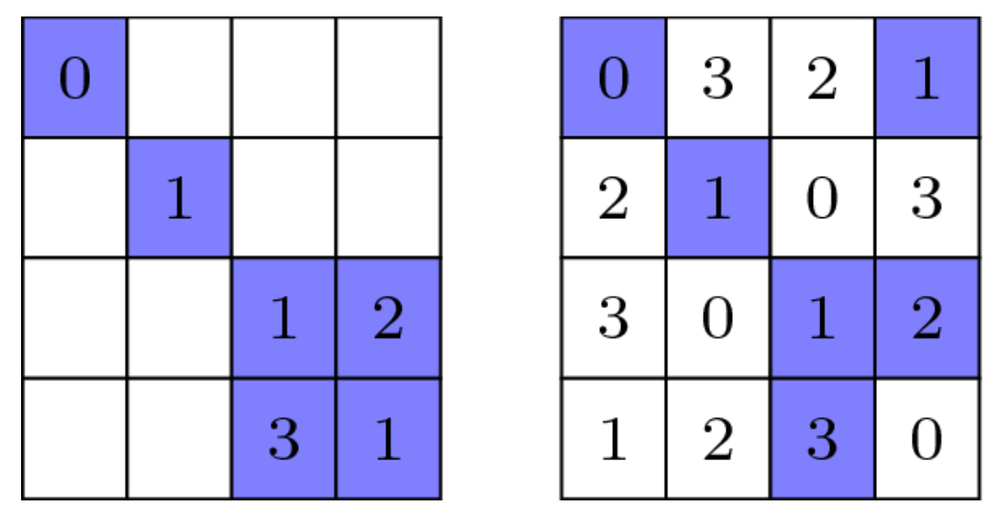
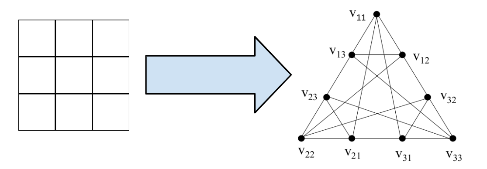
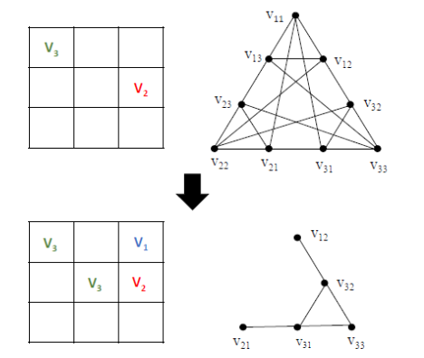
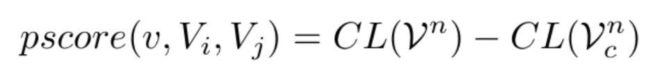

# Latin-Square-Completion

## Introduction

A Latin square of order ```n``` is a ```nxn``` matrix consisting of n symbols (i.e., {1, 2, . . . , n}) in which each symbol occurs exactly once in each row and exactly once in each column. If some grids are empty, then the Latin square complete (LSC) problem of order n aims to complete the empty grids with n symbols to obtain an arbitrary legal Latin square.



## NP-Complete Problem

Latin Square Completion is a Constraint Satisfaction Problem and hence is NP Complete in nature. This is because it can be solved only in non-deterministic polynomial time, but easy to verify in linear time (O(n)) time complexity. 

It can be defined as a Constraint Satisfaction Problem (CSP) as follows: 

```Variables```: Each cell in NxN matrix

```Domains```: {1, 2, . . . , n}

```Constraints```: Each symbol (1-n) can occur exactly once in a row and column

In this project, we aim to explore various state space reduction techniques and heuristics which can be used to solve this LSC problem, using graph-coloring representation, to reduce the computational complexity of the problem. 

## Approach

1) Transforming the problem as a Graph Colouring problem



Here, the nodes represt the cells, and the edges represent the constraints. The color of the node represents the value of the symbol in the cell.

2) Reduction of Graph



We reduce the search space by filling those cells for which the domain is not greater than 1. This allows us to significantly reduce the search space.

3) Best First Search



## Getting Started

### Prerequisites
To download and use this code, the minimum requirements are:

* make: A build automation tool.
* g++: The GNU C++ compiler.
* Operating System: Windows 7 or later (64-bit) or Ubuntu 20.04 or later.

### Installation

Clone the project by typing the following command in your Terminal/CommandPrompt

```
git clone https://github.com/PritK99/Latin-Square-Completion
```
Navigate to the Latin-Square-Completion folder

```
cd Latin-Square-Completion
```

### Usage

Once you have installed the prerequisites and cloned the project, you can start using it. Follow these commands:

To compile all targets / algorithms, run

```sh
make all
```


To compile only a specific target / algorithm (from BFS, DFS, BestFS or PLITS {sequential & parallel}), run (e.g. for bestfs)

```sh
make bestfs
```

To execute any program, run (e.g. for bfs)

```sh
./bfs
```

<b>Note</b>: When running the parallel PLITS algorithm, you can specify the number of threads as an argument. For example:

```sh
./plits_par 4
```

To remove the executables, run 

```sh
make clean
```

## Output

### 1. BFS implementation

https://github.com/PritK99/Latin-Square-Completion/assets/103848930/e11bd36a-c30c-4a15-8a34-94802e0505b8

### 2. DFS implementation

https://github.com/PritK99/Latin-Square-Completion/assets/103848930/ffdf1d8a-355e-49a3-a615-7b98704570bb

### 3. Best First Search Implementation

https://github.com/PritK99/Latin-Square-Completion/assets/103848930/e7c7b531-2bf7-48bd-8bfc-bc58b2d0e795

### 4. Reduction and Smart Solving Techniques

https://github.com/PritK99/Latin-Square-Completion/assets/103848930/6131050e-931a-4c0d-aca0-84f5be7df869

### 5. 4x4 LSC using Heuristics and Reductions

https://github.com/PritK99/Latin-Square-Completion/assets/103848930/01a084e4-61a1-4614-b01a-fa5425ecb1bf

## References

A Fast Local Search Algorithm for the Latin Square Completion Problem (AAAI 22) by Shiwei Pan, Yiyuan Wang, Minghao Yin
