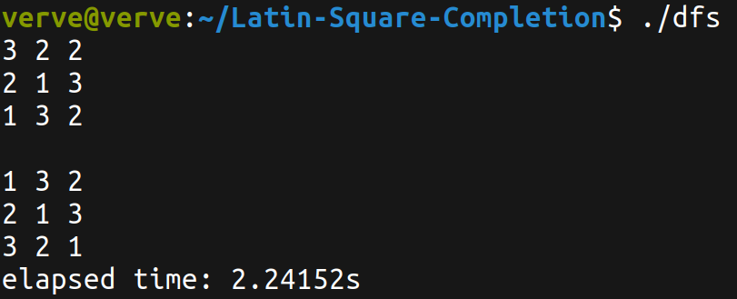

# Latin-Square-Completion using Parallel Maximum Independent Set Algorithm


# Table of Contents

- [Project](#latin-square-completion-using-parallel-maximum-independent-set-algorithm)
  - [Table of Contents](#table-of-contents)
  - [Introduction](#introduction)
  - [Approach](#approach)
  - [File Structure](#file-structure)
  - [Results](#results)
  - [Getting Started](#getting-started)
  - [Output](#output)
  - [References](#references)
  - [License](#license)


## Introduction

## Latin Sqaure Completion

A **Latin Square** of order $n$ is an $n \times n$ array filled with $n$ distinct symbols, typically represented by the set $\lbrace1, 2, ..., n\rbrace$, such that each symbol appears exactly once in each row and each column. Formally, an $n \times n$ array $L = [l_{ij}]$ is a Latin square if for all $i, j, k$ in $\lbrace1, 2, ..., n\rbrace$:

- $l[i][j] \neq l[k][j]$ for $i \neq k$ (distinct symbols in every column),
- $l[i][j] \neq l[i][k]$ for $j \neq k$ (distinct symbols in every row).

**Latin Square Completion (LSC)** refers to the process of filling in an incomplete Latin square, where some entries are missing, such that the filled entries satisfy the Latin square properties. Specifically, given a partially filled $n \times n$ array $L = [l_{ij}]$ with some missing entries, the goal is to fill in the missing entries with symbols from the set $\lbrace1, 2, ..., n\rbrace$ such that the resulting array is a Latin square.

Latin Square Completion is an NP Complete problem and can be framed as Constraint Satisfaction Problem. This is because it can be solved only in non-deterministic polynomial time, but easy to verify in linear time $(O(n^2))$ time complexity, where $n$ is the dimension of problem. 

It can be defined as a Constraint Satisfaction Problem (CSP) as follows: 

```Variables```: Each cell in NxN matrix

```Domains```: $\lbrace1, 2, ..., n\rbrace$ 

```Constraints```: Each symbol ($1 \dots n$) can occur exactly once in a row and column

In this paper, we aim to explore MIS Graph Coloring Algorithm for solving a latin square.

## Approach

### Pre-Processing

1) Transforming the problem as a Graph Colouring problem


Here, the nodes represt the cells, and the edges represent the constraints. The color of the node represents the value of the symbol in the cell.

2) Reduction of Graph


We reduce the search space by filling those cells for which the domain is not greater than 1. This allows us to significantly reduce the search space.

### Maximal Indepedent Search (MIS) for Graph Coloring

The Maximal Independent Set (MIS) algorithm is a well-known greedy approach for **graph coloring**, used in scheduling, register allocation, and parallel computing. Graph coloring assigns colors to vertices such that no two adjacent vertices share the same color.  

The algorithm iteratively extracts **maximal independent sets (MIS)**, where an **independent set** is a vertex subset $I$ such that $\forall u, v \in S$, $(u,v) \notin E$. A **maximal** independent set is one that cannot be extended without violating this property.  

### Algorithm:  
1. **Initialize** an empty set $I$.  
2. **Iterate** over vertices, adding $v$ to $I$ if $\forall u \in I, (u,v) \notin E$.  
3. **Assign** a unique color $c$ to all vertices in $I$.  
4. **Remove** $I$ from the graph.  
5. **Repeat** until all vertices are colored.  

Each extracted $I$ gets a distinct $c$, ensuring all vertices are colored while maintaining the independent set property.

### Proposed solution's Architecture


## File Structure
```
👨‍💻Latin-Square-Completion
 ┣ 📂assets                            // Contains all the reference gifs, images
 ┃ ┣ 📂img
 ┃ ┣ 📂scripts
 ┣ 📂include                           
 ┃ ┣ 📄lsc.hpp                         // Header file for LSC
 ┃ ┣ 📄plits.hpp                       // Header file for PLITS 
 ┣ 📂src                          
 ┃ ┣ 📄bfs.cpp                         // Breadth-First Search
 ┃ ┣ 📄dfs.cpp                         // Depth-First Search 
 ┃ ┣ 📄bestfs.cpp                      // Best-First Search
 ┃ ┣ 📄plits_seq.cpp                   // Partial Legal and Illegal Tabu Search (PLITS), Sequential
 ┃ ┣ 📄plits_par.cpp                   // PLITS, Parallelised using OpenMP
 ┃ ┣ 📄mis_par.cpp                     // Proposed Approach, MIS Parallelised using OpenMP
 ┣ 📄Makefile       
 ┣ 📄README.md   
``` 

## Results

Test environment:


## Getting Started

### Prerequisites
To download and use this code, the minimum requirements are:

* make: A build automation tool.
* g++: The GNU C++ compiler.
* Operating System: Windows 7 or later (64-bit) or Ubuntu 20.04 or later.

### Installation

Clone the project by typing the following command in your Terminal/CommandPrompt

```
git clone https://github.com/PritK99/Latin-Square-Completion
```
Navigate to the Latin-Square-Completion folder

```
cd Latin-Square-Completion
```

### Usage

Once you have installed the prerequisites and cloned the project, you can start using it. Follow these commands:

To compile all targets / algorithms, run

```sh
make all
```

To list all targets, run

```sh
$ make list
Targets (Algorithms): 
- bfs (Breadth First Search)
- dfs (Depth First Search)
- bestfs (Best First Search)
- plits_seq (Partial Legal & Illegal Tabu Search)
- plits_par (Parallelised Partial Legal & Illegal Tabu Search)
- mis_par (Parallelised Partial Legal & Illegal Tabu Search)
```

To compile only a specific target / algorithm (from BFS, DFS, BestFS or PLITS {sequential & parallel}), run (e.g. for bestfs)

```sh
$ make bestfs
```

To execute any program, run (e.g. for bfs)

```sh
$ ./bfs
```

<b>Note</b>: When running any parallel algorithm, you can specify the number of threads as an argument. For example:

```sh
$ ./plits_par 4
```

To remove any executables, run 

```sh
$ make clean
```

## Output

### 1. Breadth First Search (BFS)


### 2. Depth First Search (DFS)



### 3. Best First Search (BestFS)


### 4. Partial Legal and Illegal Tabu Search (PLITS)


### 5. Parallelised Maximal Independent Set (ParMIS)


## References

- JR Allwright, R Bordawekar, PD Coddington, K Dincer, and CL Martin. A comparison of parallel graph coloring algorithms. SCCS-666, pages 1–19, 1995.

- S Arumugam, Teresa W Haynes, Michael A Henning, and Yared Nigussie. Maximal independent sets in minimum colorings. Discrete Mathematics, 311(13):1158–1163, 2011.

- Richard A Barry and Pierre A Humblet. Latin routers, design and implementation. Journal of Lightwave Technology, 11(5/6):891–899, 1993.

- B Chapman. Using OpenMP: portable shared memory parallel programming, volume 300. MIT press, 2007.

- Marc Demange, Tınaz Ekim, Bernard Ries, and Cerasela Tanasescu. On some applications of the selective graph coloring problem. European Journal of Operational Research, 240(2):307–314, 2015.

- Olivier Goudet and Jin-Kao Hao. A massively parallel evolutionary algorithm for the partial latin square extension problem. Computers & Operations Research, 158:106284, 2023.

- MY Hsiao, DC Bossen, and RT Chien. Orthogonal latin square codes. IBM Journal of Research and Development, 14(4):390–394, 1970.

- Yan Jin and Jin-Kao Hao. Solving the latin square completion problem by memetic graph coloring. IEEE Transactions on Evolutionary Computation, 23(6):1015–1028, 2019.

- Charles F Laywine and Gary L Mullen. Discrete mathematics using Latin squares, volume 49. John Wiley & Sons, 1998.

- Shiwei Pan, Yiyuan Wang, and Minghao Yin. A fast local search algorithm for the latin square completion problem. In Proceedings of the AAAI Conference on Artificial Intelligence, volume 36, pages 10327–10335, 2022.

- DA Preece. Latin squares as experimental designs. In Annals of discrete mathematics, volume 46, pages 317–342. Elsevier, 1991.

- Weixiong Zhang. State-space search: Algorithms, complexity, extensions, and applications.
Springer Science & Business Media, 1999.

## License
[MIT License](https://opensource.org/licenses/MIT)
